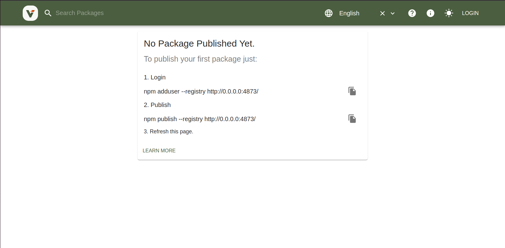

# Node - working with ES6 and CommonJS libraries

This is a simple project demonstrating how we can use ES6 and CommonJS libraries in a Node project with Jest and the
corresponding configurations needed for each tool.

The use case is to mimic a real world scenario where we may find ourselves using a mix of ES6 and CommonJS libraries in
a professional project that will require testing.

To add to the realism here, the project assumes the following requirements to the base-node-project:
- Both the ES6 and CommonJS libraries are published on a private registry
- We cannot update the libraries (they belong to another team)
- The project is using Jest for testing
- The project is of type 'module'

## Tooling involved
- Node v20 or greater
- Jest
- Webpack
- Verdaccio (private registry to host the libraries on your local machine)

## Getting started
After cloning the project, you'll want to setup [Verdaccio](https://verdaccio.org/docs/what-is-verdaccio) so you can publish the libraries to your local registry.

### Verdacchio Setup
1.`cd` into the `private-registry-verdaccio` directory. Then pull the docker image & start the container with the following command:
```bash
docker-compose up
```
You should see output like the following in your terminal once the container is up and running:
```bash
 ⠿ Container verdaccio  Created                                                                                                                                                                                             0.0s
Attaching to verdaccio
verdaccio  |  warn --- config file  - /verdaccio/conf/config.yaml
verdaccio  |  warn --- Plugin successfully loaded: verdaccio-htpasswd
verdaccio  |  warn --- Plugin successfully loaded: verdaccio-audit
verdaccio  |  warn --- http address - http://0.0.0.0:4873/ - verdaccio/5.1.1
```


**If you visit `http://0.0.0.0:4873/ or http://localhost:4873/`, you should see the welcome screen for Verdaccio.**


2. Login to the registry with the following command:
```bash
npm adduser --registry http://0.0.0.0:4873/
```

3. Now lets publish our first package. `cd` into the `es6-node-library` directory and install the dependencies, then build and publish the package with the following commands:
```bash
# Install dependencies
npm install

# Build the package
npm run build

# Publish the package
npm publish --registry http://0.0.0.0:4873/
```
4. Repeat the previous steps for the `cjs-node-library` directory as well.

5. At this point, you should have both the ES6 and CommonJS libraries published to your local registry and you should be able to see them by navigating to `http://localhost:4873/`

### TODO - maybe turn into an article/tutorial
